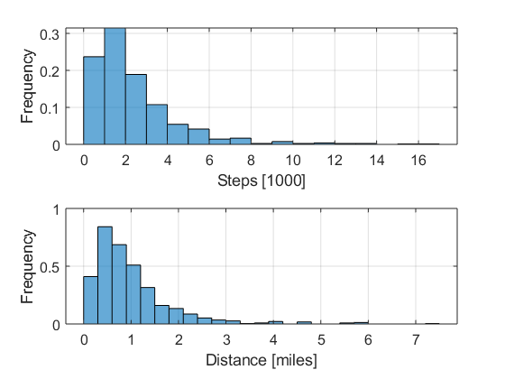

---

# Apple Health Data Extractor

## Installation

This m script is self contained and can be run directly from MATLAB.

## Citation

If you use `Apple Health Data Extractor` to extract step count or distance data for your publication, please cite it as:

## Summary

With the increased interest in activity monitoring, especially step counting, the ability to accurately measure and record steps is imperative. Commonly-available commercial products such as FitBit, Jawbone and ActiGraph can be worn to measure steps in addition to other activitys [@tudor2008revisiting]. These devices have been shown to be accurate in step-counting studies [@veerabhadrappa2018tracking]. However, they require that 

- subjects remember to wear the device at all times, 
- researchers purchase and maintain enough devices to run a large-scale study
- subjects periodically upload their data in a long-term study

A solution to these problems is to leverage a device that many subjects will already own and is already counting their steps: an iPhone. The Apple Health app is, by default, counting steps and distance traveled. Subjects own their own device, need not install any software and will likely remember to have it with them all the time. The difficult part in research studies is collecting and analyzing the data from the phone. Subjects can export the data to an xml file contained within a zip file that contains their movement data. 

The data is structured in time epochs of several minutes of step and distance data. This program extracts daily step and distance data from the exported zip file from the Apple Health app. In this version, a single zip file can be selected and analyzed. A loop can be written around the script to automate the extraction process in a batch. 

Instructions to retrieve the raw data from the app are in the pdf file.
  
Apple Health writes the data in epochs of various lengths of time. Data in epochs that pass through midnight local time are counted all in the second day.

The script produces two matrix variables: `steplist` and `distlist`. `steplist` is a two-column vector with the date in YYYYMMDD format as the first column and the number of steps recorded that day as the second. `distlist` is a two-column vector with the date in YYYYMMDD format as the second column and the distance traveled (in miles) recorded that day as the second. For visualization and spot-checking, the script will also produce histograms of the two metrics. 

An example health data file from an iPhone 6 running iOS 11.3 is included in the archive as `example.zip`. 

The output of the example file produces the two matrices and following histograms:

### Getting the data file from the iPhone

1.	Open or search for the “Health” app from your home screen. 

2.	Once the app opens, you will see the screen below. Tap on the red profile icon in the top right of the app.

3.	The screen below will then open. Scroll down to “Export Health Data” and click on the button. It will ask you if you are sure, click “Export”. Select how you want to get the data file. You can email it to using “Mail” or “Gmail” (whatever you use to check your email) or save it to a cloud service like Dropbox. The file will be in zip format and, by default, called “export.zip”. 

## References

